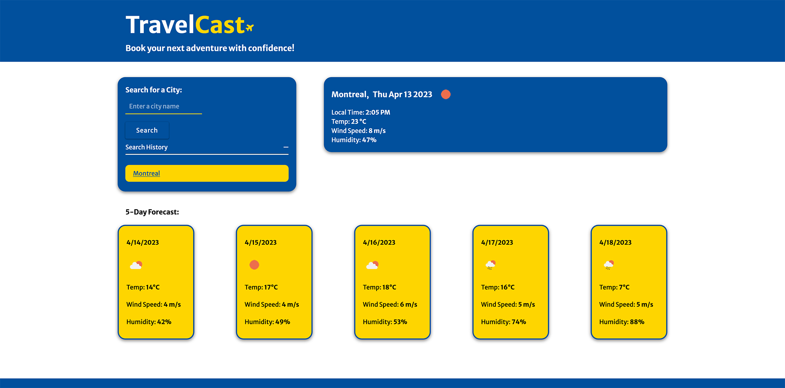

# TravelCast

A weather outlook app for travelers looking to book their next adventure.

## Table Of Contents

1. [Overview](overview)
    - [The Assignment Brief](#the-assignment-brief)
    - [User Story](#user-story)
    - [Acceptance Criteria](#acceptance-criteria)
2. [Github Pages And Repository Links](#github-pages-and-repository-links)
3. [TravelCast Screenshots](#travelcast-screenshots)
4. [My Process](#my-process)
    - [Built with](#built-with)
    - [What I learned](#what-i-learned)
    - [Continued Development](#continued-development)

## Overview

### The assignment Brief

Build a weather dashboard that will run in the browser and feature dynamically updated HTML and CSS.

### User Story

As a traveler, I want to see the weather outlook for multiple cities, so that I can plan a trip accordingly.

### Acceptance Criteria

Given a weather dashboard with form inputs:

- When I search for a city, then I am presented with current and future weather conditions for that city and that city is added to the search history.

- When I view the current weather conditions for that city, then I am presented with the city name, the date, an icon representation of the weather conditions, the temperature, the humidity, and the wind speed.

- When I view future weather conditions for that city, then I am presented with a 5-day forecast that displays the date, an icon representation of weather conditions, the temperature, the wind speed, and the humidity.

- When I click on a city in the search history, then I am again presented with the current and future conditions for that city.

## Github Pages And Repository Links

[TravelCast Github Pages](https://matthew-millard.github.io/travelcast-app/)

[ TravelCast Github Repository](https://github.com/matthew-millard/travelcast-app)

## TravelCast Screenshots

## My Process

### Built with

- OpenWeather Map API

- Google Timezone API

- HTML

- CSS

- JavaScript

- Flexbox

- VS Code

- Mobile-first workflow

- Firefox and Google Chrome developer tools

### What I learned

First time fetching data from an API. Filtering the data that I needed and appling it to the application.

Second time storing and retrieving data from local storage. Definetly helped solidify that.

I applied some "Seperation of concerns" by only using data attributes with a prefix of `data-js` as JavaScript selectors.

### Continued Development

- Change the weather condition icons.

- Allow the user to delete the search history tabs individually whilst also removing it from local storage.

- Rectify code. I feel the code is very messy and requires a good scrub.